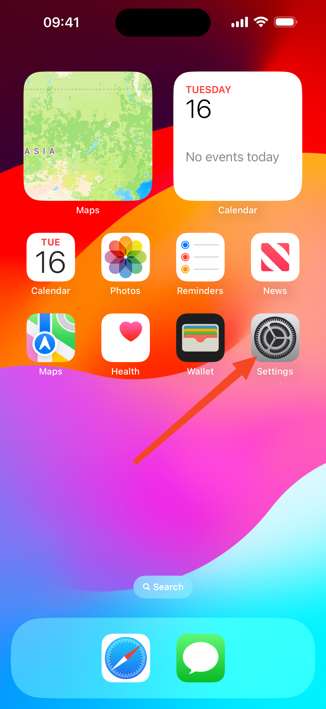
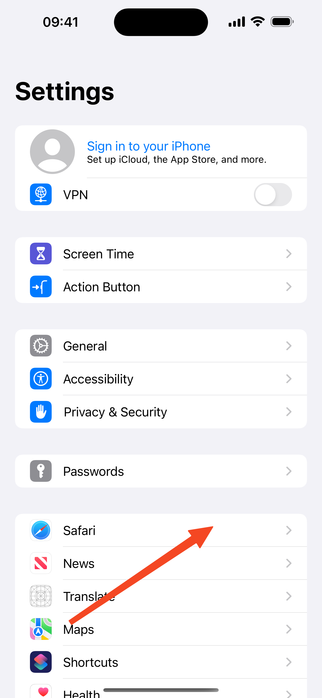
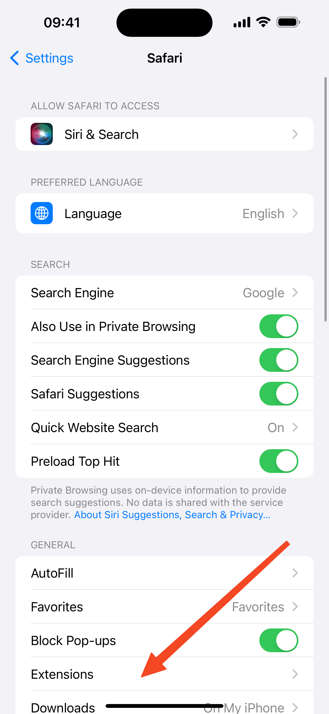
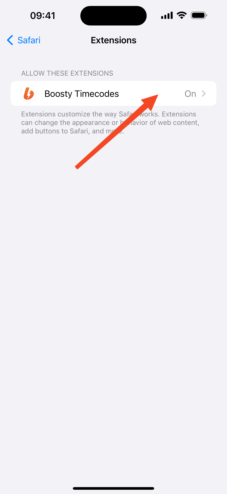
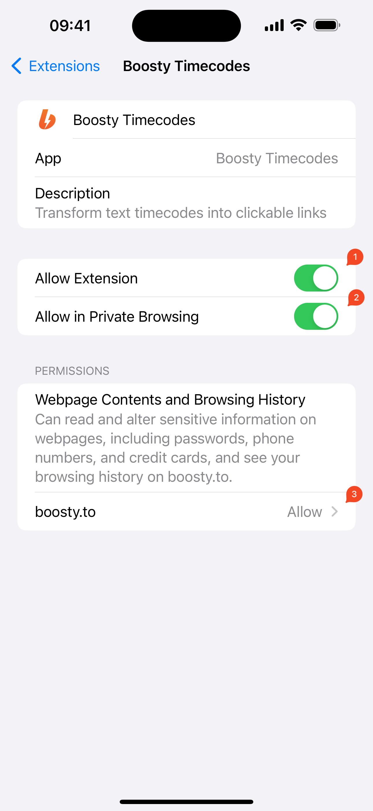

## Follow these steps to enable:
1. Open **Settings**

1. Tap **Safari**

1. Tap **Extensions**

1. Tap **Boosty Timecodes**

1. Enable extension
    1. Allow Extensions
    1. Allow in Private Browsing
    1. Set permissions to **Allow**
