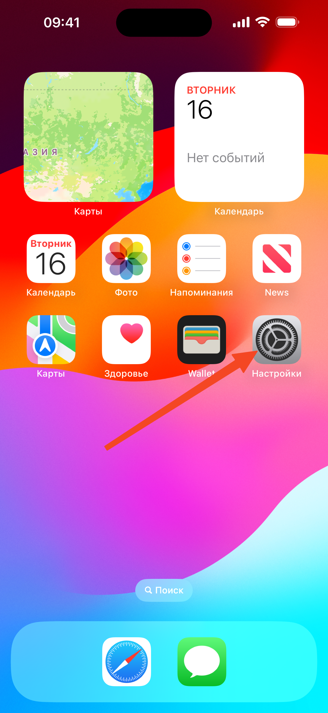
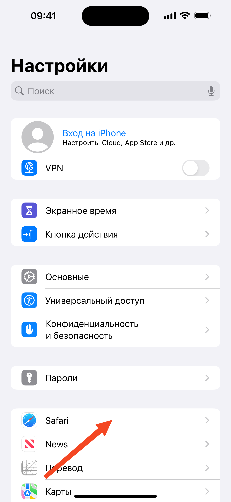
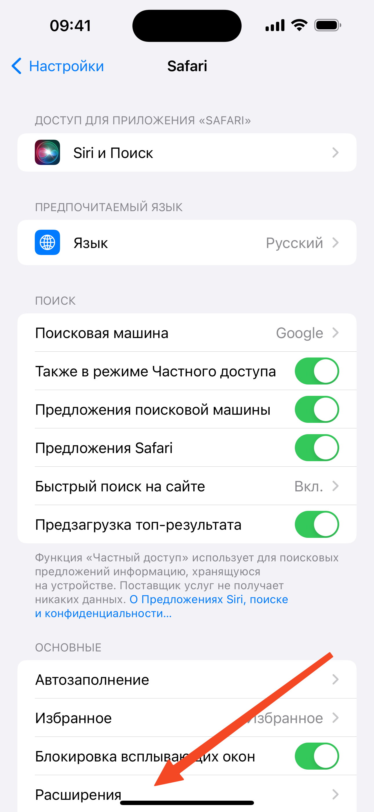
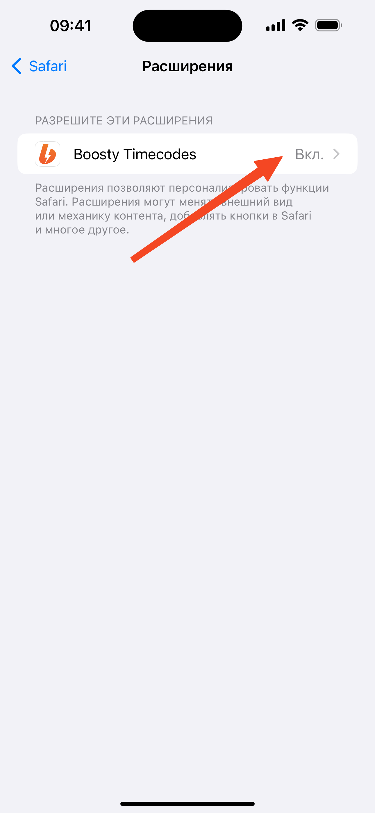
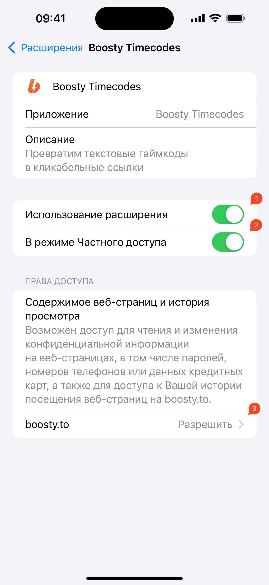

## Как включить:
1. Открываем **Настройки**

1. Нажимаем **Safari**

1. Потом **Расширения**

1. Нажимаем **Boosty Timecodes**

1. Включаем
    1. Использование расширения
    1. В режиме Частного доступа
    1. Выставляем права доступа в **Разрешить**

